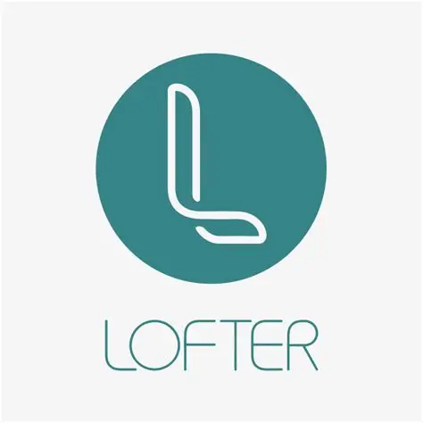
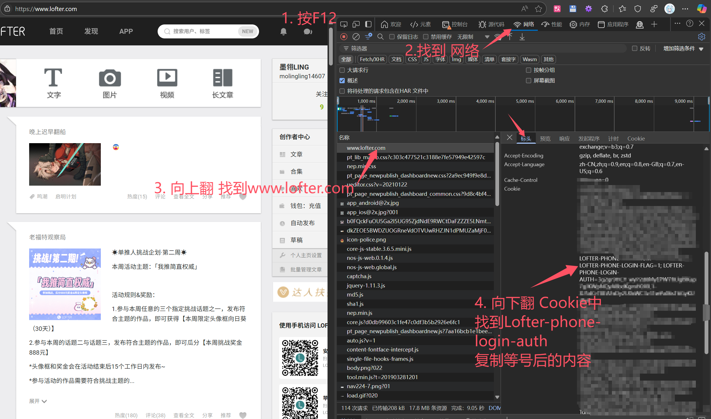

# LofterPictureSpider
利用手机端API简单实现了爬取Lofter图片（目前新增文本，视频）。

## New!
**新增合集采集功能。详见[Collection](Collection/README.md)文件夹。**
 

新增使用lofter-phone-login-auth进行“我的喜欢”采集。代码位于Likes文件夹下，启动方式依然是launcher.py。\
目前已经支持收集已付费的彩蛋内容（未付费的不可采集）。\
**如果想要收集彩蛋内容，则<u>必须</u>填写lofter-phone-login-auth。**\
**如果你的收藏为公开状态（一般默认是公开），那么可以不填写lofter-phone-login-auth，只填写博客链接。**\
博客链接格式为 xxx.lofter.com，不要写https的协议。\
xxx 为你的Lofter ID，手机端可见，在“我的”界面昵称下方。

>[!TIP]
> 获取lofter-phone-login-auth，推荐：
> - 苹果手机，安装Reqable进行抓包（安卓不推荐，无法安装系统CA证书）。
> - 电脑网页端使用手机号登录，F12开发者模式，详见[教程：img-2.png](img/img-2.png)
> 
> \
> - 安卓手机可以尝试使用Kiwi Browser中的开发者模式。（不过运行这个程序肯定要电脑，不如咱就用方法2吧）

Likes/launcher.py现在也有新增的参数，--refresh 1 表示更新喜欢列表（准确的说是喜欢的帖子数量） --proxies 1 表示启用代理。

>[!IMPORTANT]
> 使用代理之前，请先确保get_proxies已经被正确设置或者修改为你的代理标准。

## 如何使用？
> [!TIP]
> 为防止爬取过快被封IP，本repo使用代理池。\
> 8月4日对代理池方式进行了更改。原来的方式有bug，https全部没有走代理。（建议自行找一个代理池）\
> 推荐免费代理池来源（请检查https可用性）：[Python3WebSpider / ProxyPool](https://github.com/Python3WebSpider/ProxyPool)\
> 如有其他代理池，请在[Amain.py](Tags/Amain.py)中修改。\
> 不使用代理池，请将[launcher.py Line-59](https://github.com/Moling-Teru/LofterPictureSpider/blob/main/launcher.py#L59)的proxies参数改为0。\
> 目前测试看来Lofter的防爬措施不严格，单IP不用代理也可以正常使用。

使用前请先安装依赖。
**程序入口为[launcher.py](Tags/launcher.py)，程序设置位于[config.yaml](Tags/config.yaml)。**

爬虫内容保存在contents目录下。如果有内容下载失败，链接会保存在errors.txt中。\
图片格式统一为png，文本格式为html，视频格式为mp4。
详细信息可以观察内容文件夹中的log。

> [!IMPORTANT]
> 重试下载可以使用[retry_it.py](Tags/retry_it.py)。但是目前只支持图片下载，且如果重试下载成功，请手动清空errors.txt。

默认最大进程数为3，如果需要修改，请在[launcher.py Line-44](https://github.com/Moling-Teru/LofterPictureSpider/blob/main/launcher.py#L44)中修改。

### 已知问题

- Lofter目前API受限，只能获取到前1000个帖子。对于大部分热门tag的榜单，尤其是总榜，基本是半报废状态。
- 我的喜欢内容采集不受限制，但是已失效帖子依然无法采集。（Lofter保留了帖子的id等信息，但是没有提供帖子内容的任何访问方式。）
- 彩蛋内容需要完整Cookie和云端校验，没法绕过，必须付费。短期内没有开发通过Cookie获取已经付费的内容的计划。
